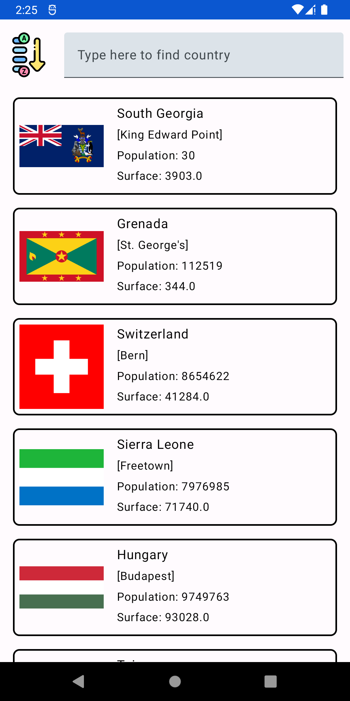
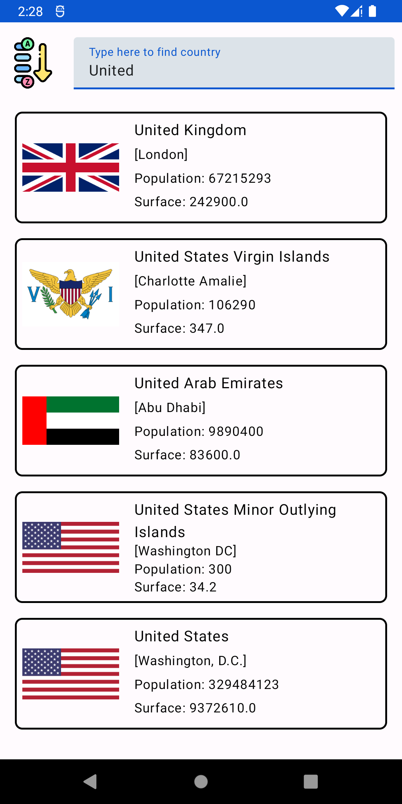
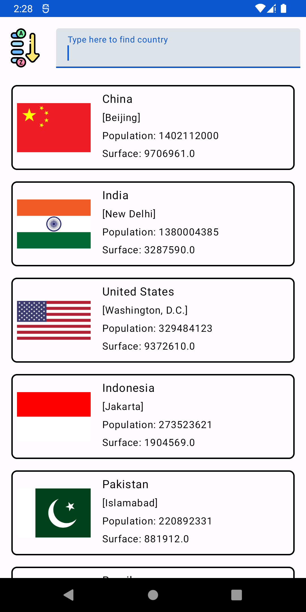
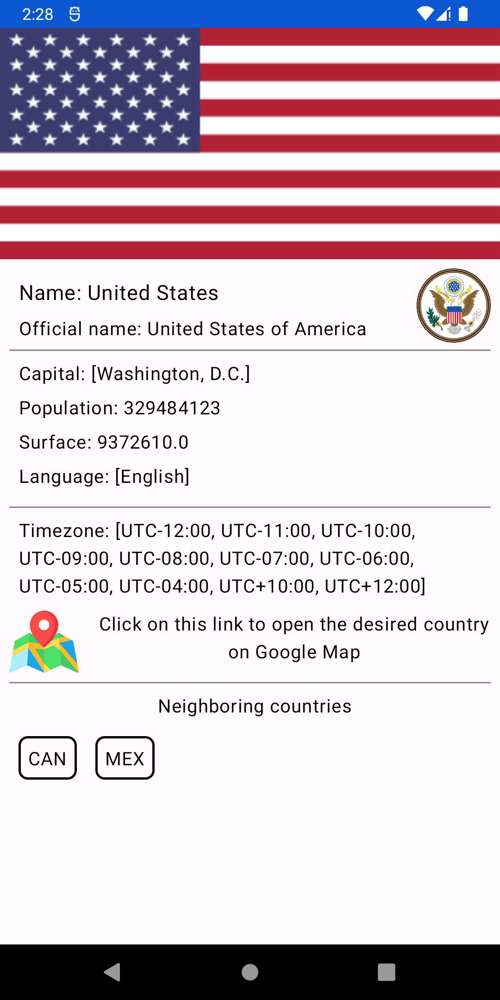

# Countries Info Application

The application uses Clean architecture with MVVM and View model. The UI layer was made using
Jetpack Compose. Asynchronous work is implemented with the Kotlin Coroutines library. The project is
divided into 3 gradle modules: Android Application, network layer, domain layer.

## Technologies used

- Jetpack Compose
- Clean Architecture + MVVM
- Multi-module Gradle project
- Koin
- AndroidX Navigation
- Retrofit
- Coroutines
- Coil Image Downloader
- Material Theme
- Unit tests

## Application

### Main Screen

### Main Screen with search query

### Main Screen with sorting parameter

### Detail Screen

